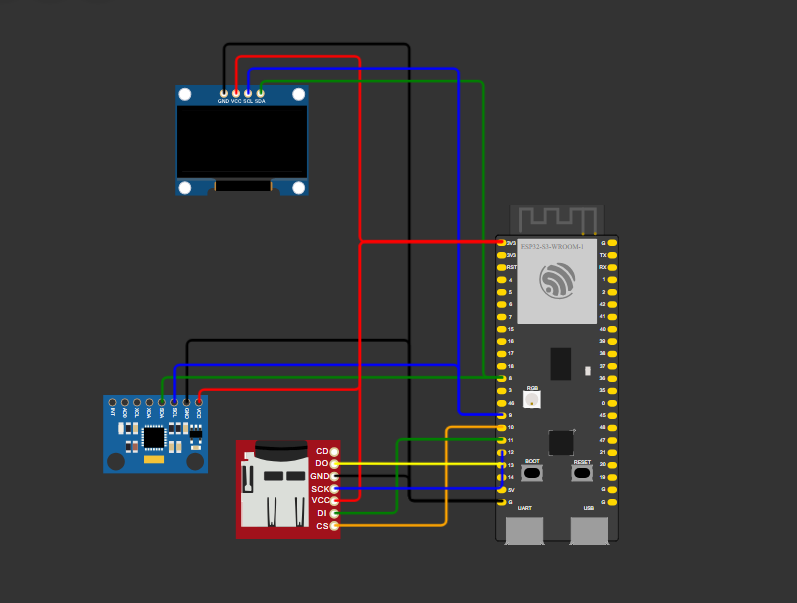

# Atividade 2: Comunicação Serial (Simulador)

**Disciplina:** Internet das Coisas (IoT)  
**Aluno:** Vinicius Batista Duarte  
**Simulador:** [Wokwi](https://wokwi.com/projects/474244888531943425)

---

## Objetivo

Desenvolver um sistema embarcado explorando as três principais interfaces de comunicação serial usadas em sistemas IoT — **I²C**, **SPI** e **UART** — a partir da integração de múltiplos periféricos em torno de um microcontrolador ESP32:

- Leitura de sensor via **I²C** (MPU6050) e exibição em display **I²C** (SSD1306);
- Armazenamento dos dados lidos em cartão SD via **SPI**;
- Monitoramento e interação com o sistema via **UART** (Monitor Serial).
---

## Circuito no Wokwi

Projeto simulado disponível em:

**[Wokwi — Atividade 2](https://wokwi.com/projects/474244888531943425)**

<!--
Insira aqui a imagem/print do circuito montado no Wokwi.
Exemplo (salve o print como "circuito.png" na raiz do projeto):
-->

---

## Material Utilizado

| Componente | Interface | Função |
|---|---|---|
| ESP32-S3 DevKitC-1 | — | Microcontrolador principal |
| MPU6050 | I²C | Leitura de aceleração (3 eixos) |
| Display OLED SSD1306 | I²C | Exibição dos dados lidos |
| Módulo/Cartão MicroSD | SPI | Armazenamento dos dados em arquivo `.csv` |
| Monitor Serial | UART | Logs, status e terminal interativo |

### Mapeamento de Pinos (ESP32-S3)

| Sinal | Pino GPIO |
|---|---:|
| I²C SDA | 8 |
| I²C SCL | 9 |
| SPI MOSI/DI | 11 |
| SPI SCK | 12 |
| SPI MISO/DO | 13 |
| SPI CS | 10 |

---

## Estrutura do Projeto

_├── main.c            # appmain e tarefas FreeRTOS_
_├── mpu6050.c / .h    # Driver do acelerômetro (I²C)_
_├── ssd1306.c / .h    # Driver do display OLED (I²C)_
_└── sdcard.c / .h     # Driver do cartão SD (SPI)_