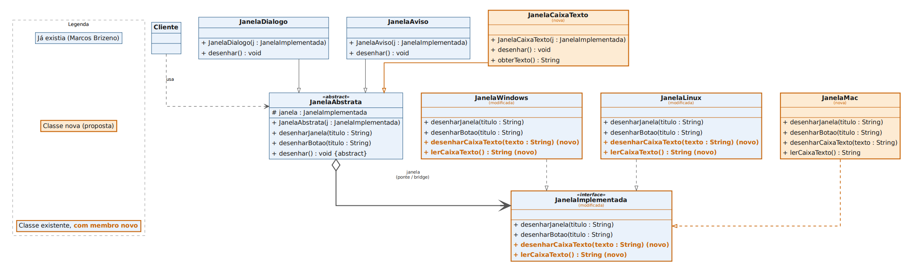

# Modificações propostas no código do exemplo "Mão na massa: Bridge"

Fonte original: [Marcos Brizeno](https://brizeno.wordpress.com/2011/10/13/mao-na-massa-bridge/)

## Objetivo

1. Suportar a plataforma **MacOS** (além de Windows e Linux já existentes).
2. Suportar uma nova abstração de janela com **entrada de dados** (uma Janela do tipo "EditBox" / Caixa de Texto), válida para qualquer sistema operacional.

---

## 1. `JanelaImplementada.java` — modificado

Precisa de dois métodos novos: um para desenhar a caixa de texto e um para ler o que foi digitado nela. Assim, tanto a nova abstração (`JanelaCaixaTexto`) quanto a nova plataforma (`JanelaMac`) têm que respeitar o mesmo contrato.

```diff
 public interface JanelaImplementada {

 	void desenharJanela(String titulo);

 	void desenharBotao(String titulo);

+	void desenharCaixaTexto(String rotulo);
+
+	String lerCaixaTexto();

 }
```

---

## 2. `JanelaWindows.java` — modificado

```diff
 public class JanelaWindows implements JanelaImplementada {

 	@Override
 	public void desenharJanela(String titulo) {
 		System.out.println(titulo + " - Janela Windows");
 	}

 	@Override
 	public void desenharBotao(String titulo) {
 		System.out.println(titulo + " - Botão Windows");
 	}

+	@Override
+	public void desenharCaixaTexto(String rotulo) {
+		System.out.println(rotulo + " - Caixa de Texto Windows");
+	}
+
+	@Override
+	public String lerCaixaTexto() {
+		Scanner leitor = new Scanner(System.in);
+		return leitor.nextLine();
+	}

 }
```

---

## 3. `JanelaLinux.java` — modificado

Mesma alteração feita em `JanelaWindows`, só trocando o texto exibido:

```diff
 public class JanelaLinux implements JanelaImplementada {

 	@Override
 	public void desenharJanela(String titulo) {
 		System.out.println(titulo + " - Janela Linux");
 	}

 	@Override
 	public void desenharBotao(String titulo) {
 		System.out.println(titulo + " - Botão Linux");
 	}

+	@Override
+	public void desenharCaixaTexto(String rotulo) {
+		System.out.println(rotulo + " - Caixa de Texto Linux");
+	}
+
+	@Override
+	public String lerCaixaTexto() {
+		Scanner leitor = new Scanner(System.in);
+		return leitor.nextLine();
+	}

 }
```

---

## 4. `JanelaMac.java` — novo (funcionalidade 1: suporte a MacOS)

Arquivo inteiramente novo. Segue exatamente o mesmo padrão de `JanelaWindows` e `JanelaLinux`, o que mostra a vantagem do Bridge: uma nova plataforma = uma nova classe, sem tocar nas abstrações (`JanelaDialogo`, `JanelaAviso`, `JanelaCaixaTexto`) nem no cliente.

```diff
+public class JanelaMac implements JanelaImplementada {
+
+	@Override
+	public void desenharJanela(String titulo) {
+		System.out.println(titulo + " - Janela Mac");
+	}
+
+	@Override
+	public void desenharBotao(String titulo) {
+		System.out.println(titulo + " - Botão Mac");
+	}
+
+	@Override
+	public void desenharCaixaTexto(String rotulo) {
+		System.out.println(rotulo + " - Caixa de Texto Mac");
+	}
+
+	@Override
+	public String lerCaixaTexto() {
+		Scanner leitor = new Scanner(System.in);
+		return leitor.nextLine();
+	}
+
+}
```

---

## 5. `JanelaCaixaTexto.java` — novo (funcionalidade 2: EditBox)

Arquivo inteiramente novo. É uma abstração, assim como `JanelaDialogo` e `JanelaAviso`: estende `JanelaAbstrata` e delega para a implementação concreta (`janela`) recebida no construtor, sem saber qual plataforma está por trás. Além de desenhar, ela expõe `obterTexto()`, que devolve o que o usuário digitou.

```diff
+public class JanelaCaixaTexto extends JanelaAbstrata {
+
+	public JanelaCaixaTexto(JanelaImplementada j) {
+		super(j);
+	}
+
+	@Override
+	public void desenhar() {
+		desenharJanela("Janela de Entrada de Dados");
+		desenharCaixaTexto("Digite um valor:");
+		desenharBotao("Ok");
+	}
+
+	public String obterTexto() {
+		return janela.lerCaixaTexto();
+	}
+
+}
```

> `janela` é o atributo `protected` já existente em `JanelaAbstrata` (ver post original), então `JanelaCaixaTexto` só consegue usá-lo porque estende `JanelaAbstrata` — não é preciso mudar a classe abstrata para isso.

Como `desenharCaixaTexto(String)` só existe na interface `JanelaImplementada`, mas não em `JanelaAbstrata`, seria útil (embora não obrigatório) acrescentar um método de conveniência em `JanelaAbstrata` para manter o mesmo estilo dos outros métodos — ver seção 6.

---

## 6. `JanelaAbstrata.java` — modificado (opcional, mas recomendado)

```diff
 public abstract class JanelaAbstrata {

 	protected JanelaImplementada janela;

 	public JanelaAbstrata(JanelaImplementada j) {
 		janela = j;
 	}

 	public void desenharJanela(String titulo) {
 		janela.desenharJanela(titulo);
 	}

 	public void desenharBotao(String titulo) {
 		janela.desenharBotao(titulo);
 	}

+	public void desenharCaixaTexto(String rotulo) {
+		janela.desenharCaixaTexto(rotulo);
+	}

 	public abstract void desenhar();

 }
```

Isso evita que `JanelaCaixaTexto` precise chamar `janela.` direto e mantém o mesmo padrão de delegação usado por `desenharJanela` e `desenharBotao`.

---

## 7. Classe cliente (`main`) — modificado

Só para demonstrar as duas funcionalidades novas em uso:

```diff
 public static void main(String[] args) {
 	JanelaAbstrata janela = new JanelaDialogo(new JanelaLinux());
 	janela.desenhar();

 	janela = new JanelaAviso(new JanelaLinux());
 	janela.desenhar();

 	janela = new JanelaDialogo(new JanelaWindows());
 	janela.desenhar();

+	janela = new JanelaDialogo(new JanelaMac());
+	janela.desenhar();
+
+	JanelaCaixaTexto entrada = new JanelaCaixaTexto(new JanelaMac());
+	entrada.desenhar();
+	String valor = entrada.obterTexto();
+	System.out.println("Valor digitado: " + valor);
 }
```

---

## Resumo

| Categoria | Arquivos |
|---|---|
| **Novos** | `JanelaMac.java`, `JanelaCaixaTexto.java` |
| **Modificados** | `JanelaImplementada.java`, `JanelaWindows.java`, `JanelaLinux.java`, `JanelaAbstrata.java` (opcional), classe cliente (`main`) |
| **Não alterados** | `JanelaDialogo.java`, `JanelaAviso.java` |


## Diagrama 



O padrão Bridge se confirma na prática: para adicionar uma plataforma (Mac) só foi preciso criar **1 classe nova**, e para adicionar uma abstração (CaixaTexto) também só foi preciso criar **1 classe nova**. As duas hierarquias (abstração e implementação) continuam variando de forma independente, exatamente como descrito na intenção do padrão citada no post original.
